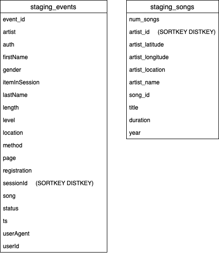
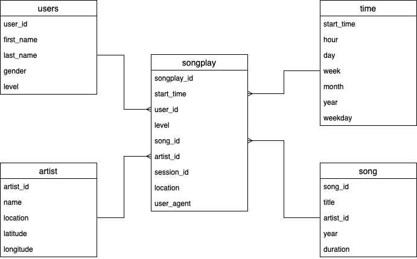
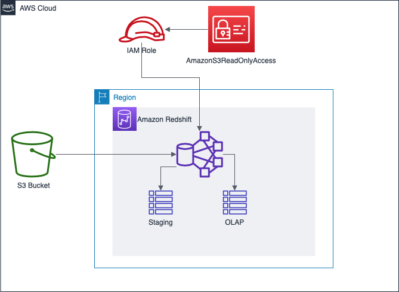

# Project 3 - Udacity Data Engineering Nanodegree

## Introduction

This project is the third one in the Data Engineering Nanodegree. This is an ETL pipeline that extracts the data of Sparkify (a fake music streaming startup) from S3, stages them in Amazon Redshift, and tranforms data into a set of dimensional tables for their analytics team to continue finding insights in what songs their users are listening to.

## Data

### Project Datasets

#### Song Dataset
The first dataset is a subset of real data from the [Million Song Dataset](http://millionsongdataset.com/). Each file is in JSON format and contains metadata about a song and the artist of that song. The files are partitioned by the first three letters of each song's track ID. For example, here are filepaths to two files in this dataset.

```
song_data/A/B/C/TRABCEI128F424C983.json
song_data/A/A/B/TRAABJL12903CDCF1A.json
```

And below is an example of what a single song file, `TRAABJL12903CDCF1A.json`, looks like.

```
{"num_songs": 1, "artist_id": "ARJIE2Y1187B994AB7", "artist_latitude": null, "artist_longitude": null, "artist_location": "", "artist_name": "Line Renaud", "song_id": "SOUPIRU12A6D4FA1E1", "title": "Der Kleine Dompfaff", "duration": 152.92036, "year": 0}
```

#### Log Dataset
The second dataset consists of log files in JSON format generated by this [event simulator](https://github.com/Interana/eventsim) based on the songs in the dataset above. These simulate app activity logs from an imaginary music streaming app based on configuration settings.

The log files in the dataset you'll be working with are partitioned by year and month. For example, here are filepaths to two files in this dataset.

```
log_data/2018/11/2018-11-12-events.json
log_data/2018/11/2018-11-13-events.json
```
And below is an example of what the data in a log file, `2018-11-12-events.json`, looks like.


## ETL

The log and song datasets are stored in a S3 Bucket. The first step in the ETL process is to move that data into staging staging tables in Amazon Redshift.



The ETL process split the data over all cluster machines. The strategy applied here is ALL distribution (also known as "broadcasting") because there is one fact table and some dimension ones. This strategy replicates small tables on all slices to speed up joins.



## Cloud Architecture

The source data is stored in a S3 bucket and the first process is to store that data in the staging tables in Amazon Redshift. After that, 



## Configuration

A `dwh.cfg` file is needed in the root of the project repository with the configuration for the Data Warehouse architecture in AWS. The following sample file can be filled:

```
[CLUSTER]
HOST=
DB_NAME=
DB_USER=
DB_PASSWORD=
DB_PORT=

[AWS]
KEY=
SECRET=

[DWH] 
DWH_CLUSTER_TYPE=multi-node
DWH_NUM_NODES=4
DWH_NODE_TYPE=dc2.large

[IAM_ROLE]
ARN=

[S3]
LOG_DATA='s3://udacity-dend/log_data'
LOG_JSONPATH='s3://udacity-dend/log_json_path.json'
SONG_DATA='s3://udacity-dend/song_data'
```